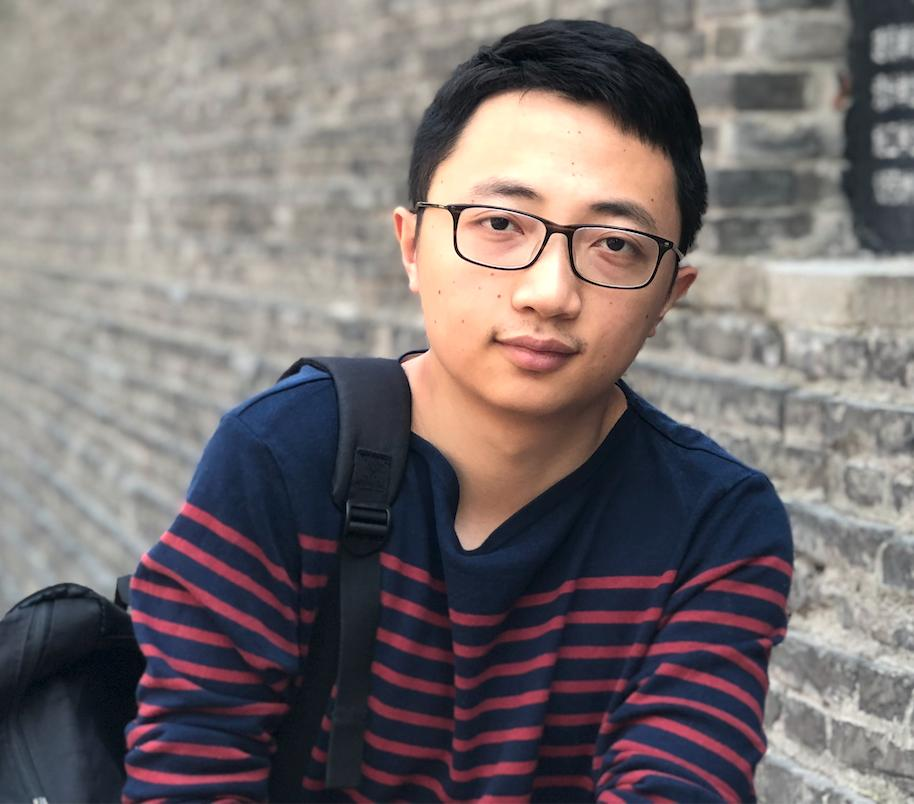

(蒋沁宏)  
Research Manager, [SenseTime Group Ltd.](https://www.sensetime.com/en/)  
Email: [jiangqinhong at sensetime dot com]()
 

## Short Biography
---  
Currently I am a research manager at SenseTime, leading the Analysis and Prediction team in autonomous driving. Our goal is to restore the dynamic scene and analyze it to make the autonomous driving system more intelligent. 

We are recruiting self-motivated researchers/developers. If you are instrested in perception (e.g, object detection, attribute analysis, state estimation and tracking, etc.), prediction(e.g, scene understanding, trajectory prediction, etc.) or automomous driving system engineering, please send me your CV.   

Before I joined SenseTime in 2018, I got my M.S. degree in the [State Key Lab of CAD&CG, Zhejiang University](http://www.cad.zju.edu.cn/english.html), supervised by [Prof. Guofeng Zhang](http://www.cad.zju.edu.cn/home/gfzhang/). Before that, I received the B.S. degree of Digital Media Technology in Zhejiang University in 2015.
 
 
 

## Research Interest 
---
Perception, Prediction, System engineering
 
 
 

## Publications
---  
Dynamic and Static Context-aware LSTM for Multi-agent Motion Prediction  
Chaofan Tao, Qinhong Jiang, Lixin Duan, Luo Ping
European Conference on Computer Vision(ECCV), 2020.

[TPNet: Trajectory Proposal Network for Motion Prediction](https://arxiv.org/abs/2004.12255)  
Liangji Fang\*, **Qinhong Jiang**\*, Jianping Shi, Bolei Zhou  
Conference on Computer Vision and Pattern Recognition(CVPR), 2020.

[Recursive Social Behavior Graph for Trajectory Prediction](https://arxiv.org/abs/2004.10402)  
Jianhua Sun, **Qinhong Jiang**, Cewu Lu  
Conference on Computer Vision and Pattern Recognition(CVPR), 2020.

[Disp R-CNN: Stereo 3D Object Detection via Shape Prior Guided Instance Disparity Estimation](https://arxiv.org/abs/2004.03572)  
Jiaming Sun, Linghao Chen, Yiming Xie, Siyu Zhang, **Qinhong Jiang**, Xiaowei Zhou, Hujun Bao   
Conference on Computer Vision and Pattern Recognition(CVPR), 2020.
 
 
 
 
 
 
 
 
 
 
 
 
 
 
 
